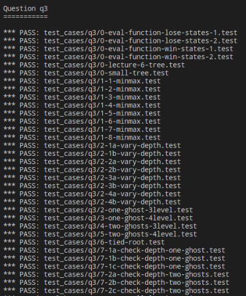
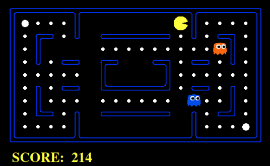
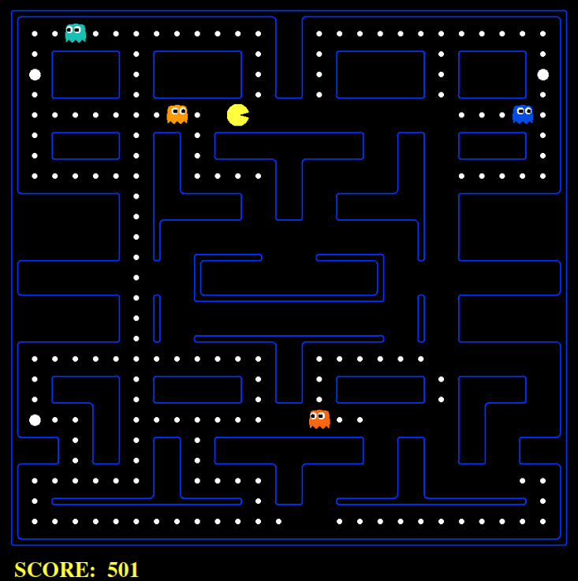

## 实验题目

本次实验有2个部分，分别是Search和Multiagent。具体而言，Search的目标是吃豆人仅仅是寻找食物；Multiagent的目标是吃完所有食物，同时避开鬼。抽象而言，Search实现的静态查找算法，Multiagent的问题是在有对手的情况下做出下一步决策使自己的利益最大化。

Search部分需要你实现BFS算法和A*算法。Multiagent部分需要你实现minimax算法和alpha-beta剪枝。**你只需要修改并向助教提交myImpl.py文件**，阅读其他代码对完成实验没有任何意义。请不要在myImpl.py文件中import其他模块，否则会造成测试失败。实验代码量大约为100行。

实验需要使用Python 3.6版本，建议使用anaconda来管理Python环境。本实验推荐使用Linux，测试只需要在命令行中运行 ./test.sh。正确代码应该PASS所有的测试。如果你实现的代码有误，请善用报错信息和print()函数。



如果你想更好的了解游戏规则，体验一下实验的乐趣，可以先完一局吃豆人。在命令行中输入以下命令即可。

```bash
cd search
python pacman.py
```



附：Conda 环境创建

```bash
conda create --name ustc-ai python=3.6
source activate ustc-ai
```


## Search

你需要实现BFS算法和A*算法。你只需要**填写myBreadthFirstSearch和myAStarSearch两个函数**。函数的返回值为从初始状态到目标状态所经过的所有状态的列表。实现时请删去util.raiseNotDefined()。

```python
def myBreadthFirstSearch(problem):
    # YOUR CODE HERE
    util.raiseNotDefined()
    return []

def myAStarSearch(problem, heuristic):
    # YOUR CODE HERE
    util.raiseNotDefined()
    return []
```


函数的参数problem可以调用3个函数。

函数getStartState可以获得该problem的初始状态。

```Python
start_state = problem.getStartState()
```

函数isGoalState可以判断当前状态state是否为目标状态。

```Python
problem.isGoalState(state) == True
```

函数getChildren可以获得state后可以到达的一系列状态。返回值是由二元组(next_state, step_cost)组成的列表。next_state是下一状态，step_cost是从state到next_state需要的代价。

```
children = problem.getChildren(state)
```

参数heuristic本身就是一个函数，可以获得当前状态到目标状态的启发式估计值。

```python
h_n = heuristic(state)
```


我们已经给出了DFS函数的参考代码，请仔细阅读并参考。

```Python
def myDepthFirstSearch(problem):
```


你可能还需要使用我们提供的栈、队列和优先队列这些数据结构。

大家在学习数据结构时可能都已经熟悉了栈和队列。它们的特点可以分别简单概括为先进后出和先进先出。

```python
stack = util.Stack()
stack.push('eat')
stack.push('study')
stack.push('sleep')
stack.pop() == 'sleep'

queue = util.Queue()
queue.push('eat')
queue.push('study')
queue.push('sleep')
queue.pop() == 'eat'
```

优先队列的使用则需要赋予一个表示优先性的值，值越小就会越先出队。

```python
pq = util.PriorityQueue()
pq.update('eat', 2)
pq.update('study', 1)
pq.update('sleep', 3)
pq.pop() == 'study'
```

3个数据结构都有isEmpty函数来判断数据结构内部是否有数据。


最终测试时，会动画显示3种搜索方法选择的路径以及搜索过的状态（红色表示），请比较一下三者的区别。


## MultiAgent

Multiagent的问题是在有对手的情况下做出下一步决策使自己的利益最大化。游戏中目标agent为吃豆人，其他agent为鬼。

我们已经实现了一个只基于当前状态做出反应的吃豆人，你可以输入以下命令查看它的表现。目录multiagent/layouts中有不同的游戏场景，你可以更改-l后的选项。你可以更改-p后的选项为MinimaxAgent或AlphaBetaAgent来测试你实现的算法。

```bash
cd multiagent
python pacman.py -p ReflexAgent -l originalClassic --frameTime 0
```




你需要实现minimax算法和alpha-beta剪枝则会提前预估几步，在最坏的打算下最优化自己的效用。你只需要**填写MyMinimaxAgent和MyAlphaBetaAgent两个类**。其中函数getNextState会被外部程序调用，获得当前状态下最优的下一个状态。你可能需要添加一些辅助函数来进行递归调用。


参数state可以调用4个函数。

函数isTerminate将返回当前状态state是否已经停止。停止状态意味着不会有下一个状态，游戏中指已经赢了或输了。

```python
state.isTerminated() == True
```

函数isMe将返回是否为目标agent在进行操作。在游戏中，True表示轮到吃豆人采取移动操作，False表示轮到某个鬼在采取移动操作。你可以用来判断当前应该最大化还是最小化效用。

```python
state.isMe() == True
```

函数getChildren将返回当前状态state接下来所有可能的状态。请使用for来遍历。注意：alpha-beta剪枝的目的是缩小搜索空间，如果在遍历getChildren()中，MyAlphaBetaAgent发现可以剪枝，请停止遍历。

```python
for child in state.getChildren():
```

函数evaluateScore将返回当前状态对于目标agent的效用。

```
score = state.evaluateScore()
```


值得注意的是算法搜索的深度depth，它指的是每个agent所走的步数。例如depth=2，有1个pacman和2个ghost，则从搜索树的最顶层到最底层应该经过pacman->ghost1->ghost2->pacman->ghost1->ghost2，操作应该为max->min->min->max->min->min。